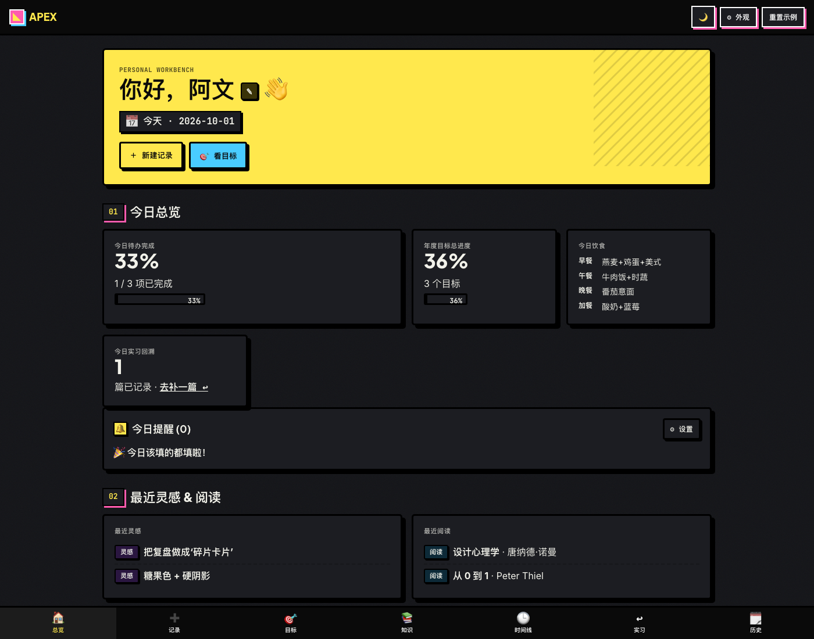
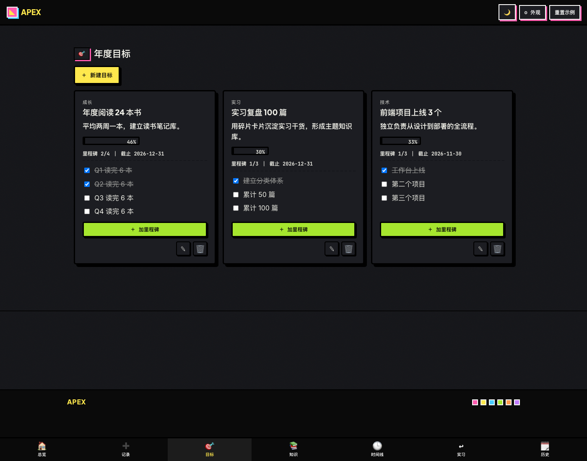
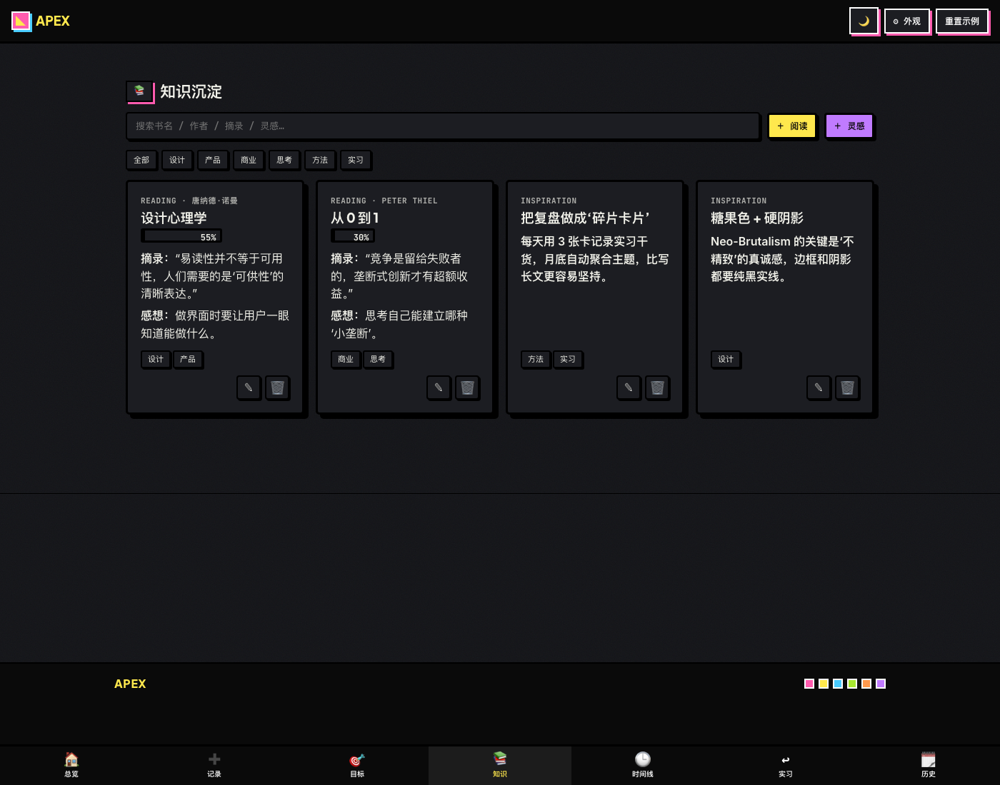
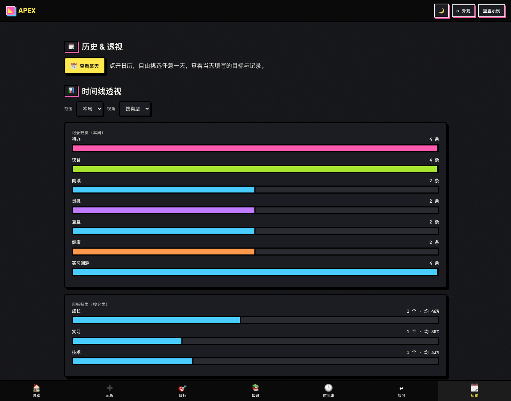
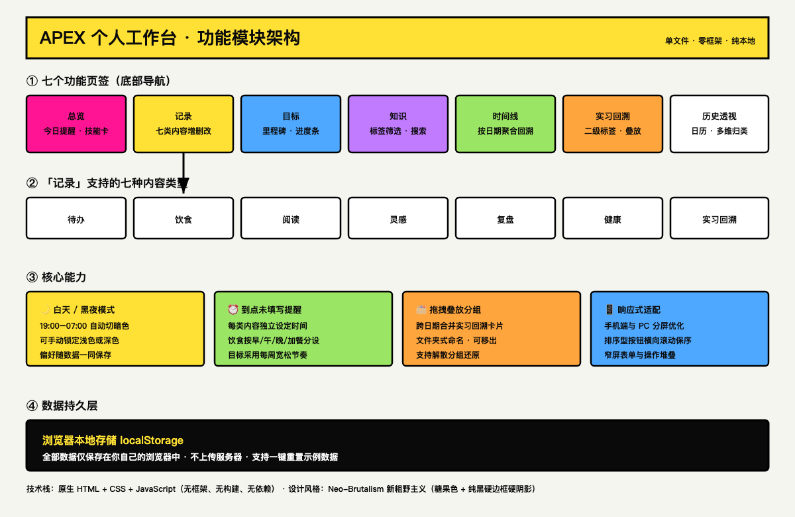

# APEX — Personal Life-Tracking Workbench


> **APEX** is a single-file, zero-framework personal workbench for logging your everyday life — todos, meals, reading, ideas, reviews, health and internship notes — together with goals, a knowledge base, a timeline and multi-dimensional history views.
> It is a **life database, not a to-do app**: every entry stays in your own browser, and the value comes from looking back.

**[Open the live workbench](https://vinceshu01.github.io/Apex-workbench/)** — no sign-in, installation, or build step required.

---

## Table of Contents

- [Overview](#overview)
- [Screenshots](#screenshots)
- [Architecture](#architecture)
- [Features](#features)
- [Quick Start](#quick-start)
- [Data & Privacy](#data--privacy)
- [Design Language](#design-language)
- [Project Structure](#project-structure)
- [Accessibility & Responsive Behaviour](#accessibility--responsive-behaviour)
- [Browser Support](#browser-support)
- [License](#license)

---

## Overview

APEX is built for people who treat their own life as a dataset. Instead of scattering notes across half a dozen apps, it puts seven kinds of daily records, long-term goals, a personal knowledge base and a reviewable timeline into one page that runs entirely offline.

Design goals:

- **Single file, zero build.** One `index.html` contains markup, styles and logic. No bundler, no package manager, no framework.
- **Local-first.** All data lives in `localStorage`. Nothing is uploaded anywhere.
- **Reviewable by design.** The point is not checking things off — it is being able to open any past day and see what you actually did, thought and ate.
- **Distinct visual identity.** Neo-Brutalism: saturated candy colours, pure-black hard borders and hard offset shadows, no blur, no gradients, no glass.

---

## Screenshots

The application interface is in Chinese. The screenshots below show the real UI.

### Overview — today's dashboard, reminders, recent ideas & reading, editable skill cards



### Goals — annual goals with milestones, progress bars and per-card actions



### Knowledge — reading notes and ideas with tag filtering and full-text search



### History & Pivot — pick any day from a calendar, plus aggregated views by type, week and month



---

## Architecture

The diagram below summarises the module layout (diagram labels are in Chinese, matching the application language).



Source vector file: [`docs/architecture.svg`](docs/architecture.svg)

---

## Features

### Seven tabs

| Tab | Purpose |
| --- | --- |
| Overview | Today's dashboard, reminder card, recent ideas & reading, editable skill cards, contact |
| Record | Create, edit and delete all seven record types, with a type switcher |
| Goals | Annual goals with milestone checklists and progress bars |
| Knowledge | Reading notes and ideas, with tag chips and live full-text search |
| Timeline | Everything aggregated by date: today / this week / earlier |
| Internship | Internship reviews grouped by two-level tags, with drag-to-stack folders |
| History | Pick any day from a calendar, plus pivot views by type, week, month and goal category |

### Seven record types

`待办` (todo) · `饮食` (diet) · `阅读` (reading) · `灵感` (inspiration) · `复盘` (review) · `健康` (health) · `实习回溯` (internship review)

Every type supports full CRUD, and each has its own form definition.

### Highlights

- **Customisable display name.** On first visit a dialog asks what to call you; all places showing the name update together, and it persists across sessions.
- **Day / night mode.** A hand-tuned dark theme keeps the hard borders and candy accents. Can follow the system, switch automatically between 19:00 and 07:00, or be locked to light or dark.
- **Deadline reminders.** If you have not filled in a category by its preset time, you get an in-app reminder (plus an optional browser notification). Meal times are configured separately for breakfast, lunch, dinner and snacks; goals use a looser weekly cadence.
- **Drag-to-stack grouping.** Internship review cards can be dragged onto each other to form a named folder, even across different dates. Members can be moved out or the folder dissolved.
- **History & pivot.** A calendar marks days that have entries; pick any day to see that day's goals and records. Pivot views aggregate by type, ISO week and month.
- **Responsive.** Horizontal-scroll ordering for segmented controls on narrow screens, stacked actions and forms, and tuned layouts for phones and split-screen desktop windows.

---

## Quick Start

Three ways to run it:

**1. Open the live demo**

<https://vinceshu01.github.io/Apex-workbench/>

**2. Open the file directly**

```bash
git clone https://github.com/VincesHu01/Apex-workbench.git
cd apex-workbench
open index.html          # macOS
# or just double-click index.html
```

No server, no install, no build step.

**3. Serve it locally** (optional, if you prefer an http origin)

```bash
python3 -m http.server 8000
# then visit http://localhost:8000
```

---

## Data & Privacy

- All data is persisted under a single `localStorage` key: **`vw_data_v1`**.
- There is **no backend and no network request** for user data. Fonts are loaded from Google Fonts; if you want fully offline behaviour, self-host or remove the `<link>` tags in `<head>`.
- On first load the app seeds demo data so the UI is never empty.
- **Reset sample data** (top-right button) clears the key and re-seeds. This is destructive and cannot be undone.
- Schema migrations run on load, so older saved data keeps working as fields are added.

Data model overview (all inside the one key):

```
profile      { name, nameAsked, skills[ {name, level} ] }
reminders    { todo, diet{meals{...}}, reading, inspiration, review, health, internship, goal }
theme        { mode: auto|light|dark, autoNight }
todos  diets  readings  inspirations  reviews  health  internships
internStacks [ { id, name, memberIds[] } ]      # drag-to-stack folders
goals        [ { id, title, category, description, progress, deadline, milestones[], updatedAt } ]
```

---

## Design Language

Neo-Brutalism, applied consistently:

- Saturated candy palette on a warm off-white ground (`#F5F5F0`), pure black `#0A0A0A` ink.
- `3px` solid black borders with hard offset shadows (`6px 6px 0 #000`) — no blur, no gradients, no glassmorphism.
- Inline SVG textures: noise, diagonal stripes and dot grids.
- Type: **Plus Jakarta Sans** for display, **Inter** for body, **JetBrains Mono** for data and metadata.
- Dark mode re-maps every surface to a dark ground while keeping the same hard-border language.

---

## Project Structure

```
Apex-workbench/
├── index.html           # the entire application (markup + styles + logic)
├── README.md
├── .gitignore
└── docs/
    ├── architecture.svg # module architecture diagram (Chinese labels)
    ├── architecture.png
    └── screenshot-*.png # overview / goals / knowledge / history
```

`index.html` is organised into clearly commented sections: data layer and seed, theme, record rendering, goals, knowledge, timeline, internship, history & pivot, reminder engine, modal/form system, and event delegation.

---

## Accessibility & Responsive Behaviour

- Semantic landmarks, buttons with `aria-label`, keyboard-operable controls.
- `prefers-reduced-motion` disables scroll-reveal and progress animations.
- `IntersectionObserver` drives scroll reveal; progress bars animate on entry.
- Breakpoints: `760px` (phones and split-screen) switches ordering controls to horizontal scroll and stacks actions/forms; `420px` further compacts type and the bottom tab bar.

---

## Browser Support

Any modern browser with ES2020, CSS custom properties and `localStorage`: Chrome/Edge, Firefox, Safari (desktop and iOS). Browser notifications require an explicit permission grant and are optional — the in-app reminder works regardless.

---

## License

MIT License. Copyright (c) 2026 VincesHu01.

Built with vibe coding.
